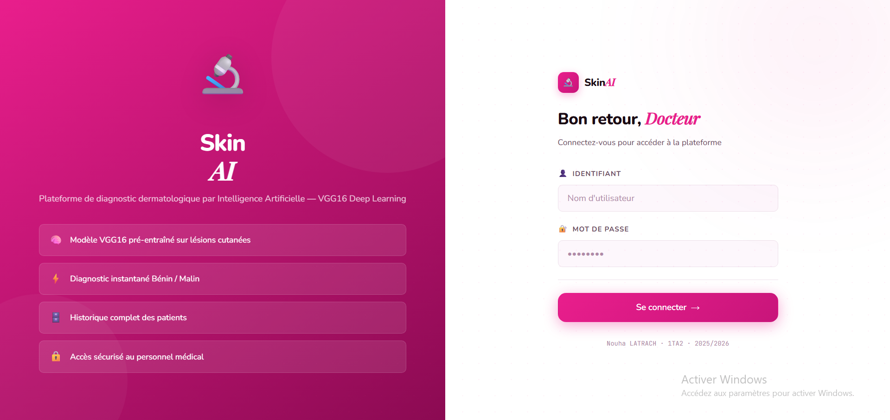
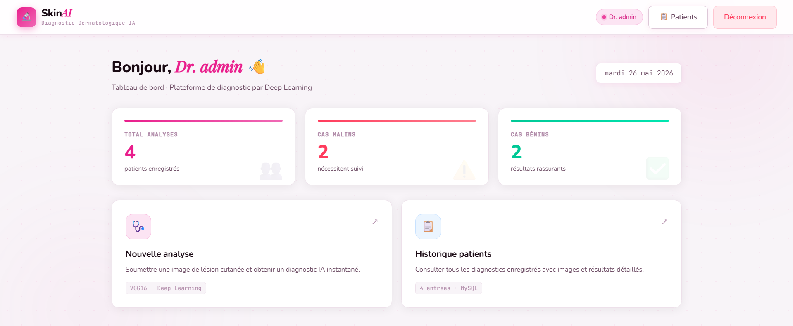
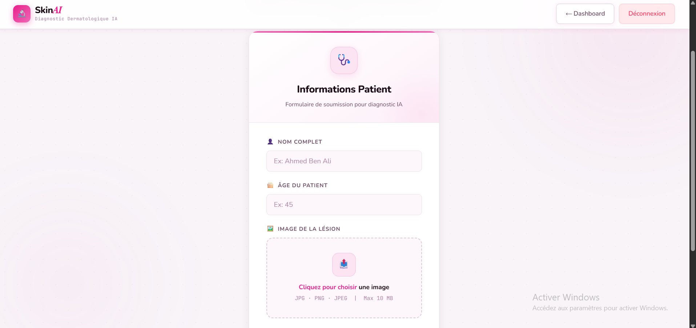
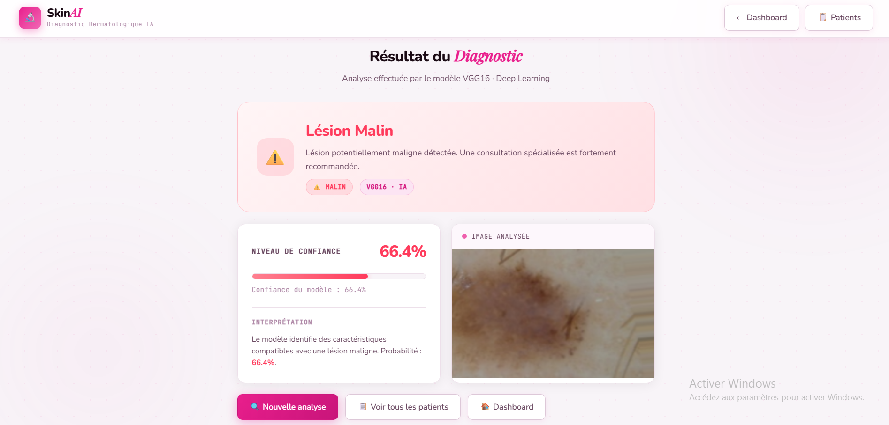
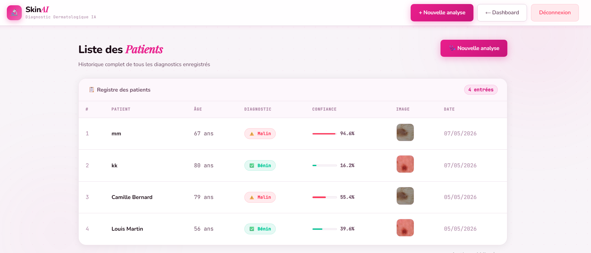

# SKIN_CANCER_APP
<div align="center">

# 🔬 SkinAI
### Plateforme de Diagnostic Dermatologique par Intelligence Artificielle


<br>

> 🏥 Application Web médicale complète intégrant un modèle **VGG16** de Deep Learning  
> pour la détection du cancer cutané — **Bénin ✅** ou **Malin ⚠️**

<br>

 **ENSTAB** · 1ère année Ingénieur Technologies Avancées · **1TA2**  
Module : Introduction à l'IA · **2025/2026**  
 Enseignante : **Amira Echtioui**  
 Étudiante : **Nouha LATRACH**

</div>

---

##  Table des matières

- [ À propos](#-à-propos)
- [ Fonctionnalités](#-fonctionnalités)
- [ Captures d'écran](#-captures-décran)
- [ Architecture](#️-architecture)
- [ Prérequis](#-prérequis)
- [ Installation](#-installation)
- [ Utilisation](#️-utilisation)
- [ Structure du projet](#-structure-du-projet)
- [ Base de données](#️-base-de-données)
- [ Modèle IA — VGG16](#-modèle-ia--vgg16)
- [ Technologies](#️-technologies)

---

##  À propos

**SkinAI** est une application web médicale professionnelle développée en **Python / Flask** dans le cadre du TD 8 — *Développement d'une Application Web IA (Partie 1)*.

Elle intègre un modèle de Deep Learning **VGG16** pré-entraîné pour analyser des images de lésions cutanées et fournir un diagnostic instantané avec un taux de confiance en pourcentage.

### Ce que fait l'application
-  Connexion sécurisée pour le personnel médical
-  Soumission d'images de lésions cutanées avec informations patient
-  Prédiction automatique **Bénin / Malin** par le modèle VGG16
-  Tableau de bord avec statistiques en temps réel
-  Historique complet des diagnostics dans une base MySQL

---

##  Fonctionnalités

| Fonctionnalité | Description |
|---|---|
|  **Authentification** | Connexion sécurisée avec session Flask |
|  **Analyse IA** | Prédiction Bénin/Malin via VGG16 + taux de confiance |
|  **Dashboard** | Statistiques en temps réel depuis MySQL |
|  **Historique patients** | Tableau avec images, badges et barres de progression |
|  **Interface rose médical** | Design professionnel, moderne et responsive |
|  **Base de données** | Stockage automatique de chaque diagnostic |
|  **Responsive** | Compatible desktop, tablette et mobile |

---

##  Captures d'écran

###  Page de Connexion
> Interface split-screen avec présentation des fonctionnalités à gauche et formulaire à droite



---

###  Tableau de Bord
> Statistiques en direct : total analyses · cas malins · cas bénins + cards d'actions



---

###  Formulaire d'Analyse
> Saisie des informations patient et upload de l'image de la lésion cutanée



---

###  Résultat du Diagnostic
> Résultat IA avec niveau de confiance animé, interprétation et image analysée



---

###  Liste des Patients
> Historique complet avec badges colorés, barres de progression et miniatures



---

##  Architecture

```
┌──────────────────────────────────────────┐
│          Navigateur Web (Client)          │
│     HTML · CSS · Bootstrap 5 · Jinja2     │
└───────────────────┬──────────────────────┘
                    │ HTTP
┌───────────────────▼──────────────────────┐
│             Flask (Python)                │
│               app.py                      │
│  /login · /dashboard · /predict           │
│  /result · /patients · /logout            │
└───────────┬──────────────────┬───────────┘
            │                  │
┌───────────▼──────┐  ┌────────▼──────────┐
│   TensorFlow     │  │   MySQL (XAMPP)    │
│   Keras · VGG16  │  │   skin_cancer_db  │
│   Prédiction IA  │  │   users·patients  │
└──────────────────┘  └───────────────────┘
```

---

##  Prérequis

| Outil | Version | Lien |
|---|---|---|
| Python | 3.11 | [python.org](https://www.python.org/downloads/release/python-3119/) |
| XAMPP | Latest | [apachefriends.org](https://www.apachefriends.org) |
| VSCode | Latest | [code.visualstudio.com](https://code.visualstudio.com) |
| Modèle VGG16 | — | Fourni par l'enseignante |

---

##  Installation

### 1️ Cloner le projet

```bash
git clone https://github.com/NouhaLatrach/SKIN_CANCER_APP.git
cd SKIN_CANCER_APP
```

### 2️ Installer les dépendances Python

```bash
pip install flask tensorflow numpy mysql-connector-python pillow
```

### 3️ Placer le modèle VGG16

```
SKIN_CANCER_APP/
└── model/
    └── vgg16_skin_cancer.h5   ← copier ici
```

### 4️ Configurer la base de données

```
1. Lancer XAMPP → démarrer Apache + MySQL
2. Ouvrir http://localhost/phpmyadmin
3. Onglet SQL → coller le contenu de database.sql → Exécuter
```

### 5️ Lancer l'application

```bash
python app.py
```

### 6️ Ouvrir dans le navigateur

```
http://127.0.0.1:5000
```

---

##  Utilisation

### Identifiants par défaut

| Champ | Valeur |
|---|---|
|  Nom d'utilisateur | `admin` |
|  Mot de passe | `1234` |

### Workflow

```
1. Ouvrir http://127.0.0.1:5000
2. Se connecter → admin / 1234
3. Dashboard → cliquer "Nouvelle analyse"
4. Remplir : Nom + Âge du patient
5. Uploader une image de lésion cutanée
6. Cliquer "Lancer l'analyse IA"
7. Résultat → Bénin ✅ ou Malin ⚠️ + % de confiance
8. Diagnostic sauvegardé automatiquement dans MySQL
9. Consulter l'historique dans "Patients"
```

---

## 📁 Structure du projet

```
SKIN_CANCER_APP/
│
├── 📁 model/
│   └── 🤖 vgg16_skin_cancer.h5      # Modèle Deep Learning VGG16
│
├── 📁 static/
│   ├── 📁 uploads/                   # Images soumises par les utilisateurs
│   └── 🎨 style.css                  # Thème rose médical professionnel
│
├── 📁 templates/
│   ├── 📄 login.html                 # Page de connexion (split-screen)
│   ├── 📄 dashboard.html             # Tableau de bord + statistiques
│   ├── 📄 predict.html               # Formulaire d'analyse patient
│   ├── 📄 result.html                # Résultat du diagnostic IA
│   └── 📄 patients.html              # Historique des patients
│
├── 📁 screenshots/                   # Captures d'écran README
│
├── 🐍 app.py                         # Serveur Flask — routes et logique
├── 📋 database.sql                   # Script SQL de création des tables
└── 📖 README.md                      # Documentation du projet
```

---

##  Base de données

### Script SQL — `database.sql`

```sql
CREATE DATABASE IF NOT EXISTS skin_cancer_db;
USE skin_cancer_db;

CREATE TABLE users (
    id       INT AUTO_INCREMENT PRIMARY KEY,
    username VARCHAR(50),
    password VARCHAR(50)
);

CREATE TABLE patients (
    id          INT AUTO_INCREMENT PRIMARY KEY,
    name        VARCHAR(100),
    age         INT,
    result      VARCHAR(20),
    probability FLOAT,
    image_path  VARCHAR(255),
    created_at  TIMESTAMP DEFAULT CURRENT_TIMESTAMP
);

INSERT INTO users (username, password) VALUES ('admin', '1234');
```

### Tables

| Table | Colonnes | Rôle |
|---|---|---|
| `users` | id, username, password | Authentification |
| `patients` | id, name, age, result, probability, image_path, created_at | Historique diagnostics |

---

##  Modèle IA — VGG16

### Architecture VGG16

```
Input Image (224 × 224 × 3)
         ↓
  Bloc 1 : Conv(64) × 2 + MaxPool
  Bloc 2 : Conv(128) × 2 + MaxPool
  Bloc 3 : Conv(256) × 3 + MaxPool
  Bloc 4 : Conv(512) × 3 + MaxPool
  Bloc 5 : Conv(512) × 3 + MaxPool
         ↓
  Flatten → Dense(4096) → Dense(4096)
         ↓
  Dense(1) → Sigmoid
         ↓
  Output : probabilité [0, 1]
  ─────────────────────────────
  < 0.5  →  Bénin  ✅
  ≥ 0.5  →  Malin  ⚠️
```

### Code de prédiction

```python
from tensorflow.keras.preprocessing import image
import numpy as np

# Chargement et redimensionnement à 224x224
img = image.load_img(img_path, target_size=(224, 224))

# Conversion + normalisation [0, 1]
img_array = image.img_to_array(img) / 255.0

# Ajout dimension batch → shape: (1, 224, 224, 3)
img_array = np.expand_dims(img_array, axis=0)

# Prédiction
prediction = model.predict(img_array)
prob   = float(prediction[0][0])
result = 'Malin' if prob > 0.5 else 'Bénin'
```

---

## 🛠️ Technologies

| Technologie | Version | Rôle |
|---|---|---|
|  | 3.11 | Langage principal |
|  | 3.0 | Framework Web |
|  | 2.15 | Deep Learning |
|  | 8.0 | Base de données |
|  | — | Serveur local |
|  | 5.3 | Framework CSS |
| Jinja2 | — | Moteur de templates HTML |
| Pillow | — | Traitement d'images Python |

---

<div align="center">

###  Développé par **Nouha LATRACH**
**1TA2 · ENSTA · 2025/2026**

<br>

*Développé avec 🌸 dans le cadre du module Introduction à l'IA*

 **N'hésitez pas à mettre une étoile si ce projet vous a été utile !**

</div>
